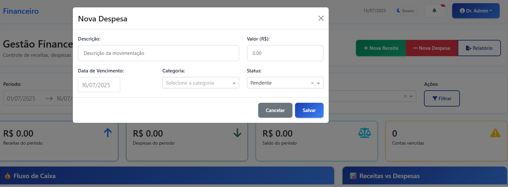

# ClinicCare - Sistema de Gestão Clínica

<div align="center">


**Sistema completo de gestão para clínicas médicas desenvolvido em Python com Dash e Plotly**

[](https://python.org)
[](https://dash.plotly.com)
[](LICENSE)
[](README.md)

</div>

---

## Visão Geral

O **ClinicCare** é uma solução completa e moderna para gestão de clínicas médicas, desenvolvida com foco na **experiência do usuário**, **performance** e **escalabilidade**. O sistema oferece uma interface web responsiva e intuitiva, com dashboards interativos e análises avançadas.

### **Principais Diferenciais**

- **Dashboards Avançados**: Heatmaps, timelines e análises em tempo real
- **Interface Moderna**: Design moderno com tema claro/escuro
- **100% Responsivo**: Funciona em desktop, tablet e mobile
- **Dados Seguros**: Tratamento robusto de dados e prevenção de erros
- **Fácil Instalação**: Setup em menos de 5 minutos
- **Código Limpo**: Arquitetura modular e bem documentada

---

## Funcionalidades Principais

### **Dashboard Executivo**
- **KPIs em Tempo Real**: Consultas, receita, taxa de comparecimento
- **Heatmap de Agendamentos**: Visualização de densidade por dia/hora
- **Timeline de Atendimentos**: Evolução histórica dos últimos 30 dias
- **Análise de Horários de Pico**: Identificação dos períodos mais movimentados

### **Agendamento Inteligente**
- **Calendário Interativo**: Interface intuitiva para agendamentos
- **Gestão de Status**: Agendado, confirmado, concluído, cancelado
- **Filtros Avançados**: Por médico, especialidade, período
- **Notificações Automáticas**: Lembretes e confirmações

### **Gestão de Pacientes (CRUD Completo)**
- **Cadastro Completo**: Dados pessoais, contato, histórico médico
- **Validação de CPF**: Algoritmo brasileiro completo
- **Busca Inteligente**: Por nome, CPF, telefone ou email
- **Controle de Status**: Pacientes ativos/inativos
- **Integridade Referencial**: Proteção contra exclusão indevida

### **Gestão de Médicos (CRUD Completo)**
- **Cadastro Profissional**: CRM, especialidade, valores de consulta
- **Validação de CRM**: Formato padrão brasileiro (CRM/UF 123456)
- **Gestão de Especialidades**: Lista predefinida + personalizada
- **Horários e Convênios**: Controle de atendimento e planos aceitos
- **Integridade Referencial**: Proteção contra exclusão se houver consultas

### **Prontuários Eletrônicos**
- **Histórico Completo**: Consultas, diagnósticos, prescrições
- **Busca Inteligente**: Localização rápida por nome, CPF ou telefone
- **Anexos Médicos**: Upload de exames e documentos
- **Evolução do Paciente**: Timeline de atendimentos

### **Gestão Financeira**
- **Controle de Fluxo de Caixa**: Receitas, despesas e saldo
- **Faturamento por Convênio**: Gestão de planos de saúde
- **Relatórios Financeiros**: Análises de rentabilidade
- **Contas a Receber/Pagar**: Controle de vencimentos

### **Comunicação com Pacientes**
- **Sistema de Mensagens**: SMS e email automatizados
- **Lembretes de Consulta**: Notificações personalizáveis
- **Campanhas de Saúde**: Comunicação em massa
- **Histórico de Comunicação**: Registro completo

### **Relatórios e Analytics**
- **Dashboards Personalizáveis**: Métricas específicas por usuário
- **Exportação de Dados**: PDF, Excel, CSV
- **Análises Preditivas**: Tendências e projeções
- **Benchmarking**: Comparação de performance
- Faturamento

### Comunicação
- Envio de lembretes
- Mensagens para pacientes
- Notificações do sistema

### Relatórios e Análises
- KPIs em tempo real
- Gráficos interativos
- Insights estratégicos
- Exportação de dados

---

## **Sistema CRUD Completo**

### **Gestão de Pacientes** (`/pacientes`)
- ✅ **CRUD Completo**: Create, Read, Update, Delete
- ✅ **Validação de CPF**: Algoritmo brasileiro completo com dígitos verificadores
- ✅ **Campos Obrigatórios**: Nome, CPF, nascimento, gênero, telefone
- ✅ **Busca Avançada**: Por nome, CPF, telefone ou email
- ✅ **Filtros Inteligentes**: Status ativo/inativo
- ✅ **Integridade Referencial**: Proteção contra exclusão se houver consultas/prontuários
- ✅ **Interface Responsiva**: Modais, tabelas e formulários adaptativos

### **Gestão de Médicos** (`/medicos`)
- ✅ **CRUD Completo**: Create, Read, Update, Delete
- ✅ **Validação de CRM**: Formato padrão brasileiro (CRM/UF 123456)
- ✅ **Campos Obrigatórios**: Nome, CRM, especialidade, telefone
- ✅ **Especialidades**: Lista predefinida + opção personalizada
- ✅ **Dados Profissionais**: Valor consulta, duração, horários, convênios
- ✅ **Integridade Referencial**: **Médico não pode ser excluído se tiver consultas vinculadas**
- ✅ **Interface Responsiva**: Modais, tabelas e formulários adaptativos

### **Validações e Segurança**
- ✅ **Validação de CPF**: Algoritmo completo brasileiro
- ✅ **Validação de CRM**: Formato padrão com UF
- ✅ **Unicidade**: CPF e CRM únicos no sistema
- ✅ **Campos Obrigatórios**: Verificação em tempo real
- ✅ **Validação de Email**: Regex para formato correto
- ✅ **Integridade Referencial**: Verificação automática de vínculos
- ✅ **Mensagens Amigáveis**: Avisos claros sobre impedimentos

### **Interface CRUD**
- ✅ **Tabelas Responsivas**: Com filtros, busca e ordenação
- ✅ **Modais Inteligentes**: Para cadastro e edição
- ✅ **Confirmação de Exclusão**: Com verificação de integridade
- ✅ **Toast Notifications**: Feedback visual para ações
- ✅ **Badges de Status**: Indicadores visuais coloridos
- ✅ **Formulários Validados**: Validação em tempo real

---

## Tecnologias

- **Dash**: Framework web interativo
- **Plotly**: Visualizações e gráficos
- **SQLite**: Banco de dados
- **Bootstrap**: Interface responsiva
- **Pandas**: Manipulação de dados

## Instalação

1. Clone o repositório:
```bash
git clone https://github.com/nathadriele/cliniccare-medical-clinic-management-system
cd clinic_care_system
```

2. Instale as dependências:
```bash
pip install -r requirements.txt
```

3. Execute a aplicação:
```bash
python app.py
```

4. Acesse no navegador:
```
URL: http://localhost:8050
```

**Funcionalidades CRUD disponíveis:**
- **Pacientes**: http://localhost:8050/pacientes
- **Médicos**: http://localhost:8050/medicos
- **Sistema completo** com validações e integridade referencial

### **Instalação com Docker** (Opcional)
```bash
# Build da imagem
docker build -t cliniccare .

# Executar container
docker run -p 8050:8050 cliniccare
```

---

## Screenshots

### **Dashboard Principal**
*Dashboard com KPIs em tempo real, heatmap de agendamentos e timeline de atendimentos*


### **Sistema de Agendamento**
*Interface intuitiva para marcação e gestão de consultas*


### **Nova Consulta**
*Interface intuitiva para nova consulta*


### **Gestão de Pacientes (CRUD)**
*Sistema completo de cadastro, edição e exclusão de pacientes com validações*


### **Edição de Dados dos Pacientes (CRUD)**
*Edição de pacientes com validações*


### **Filtro de Pacientes (CRUD)**
*Filtro de pacientes com validações*


### **Edição de Dados dos Pacientes (CRUD)**
*Cadastro de novo paciente*


### **Gestão de Médicos (CRUD)**
*Sistema completo de cadastro, edição e exclusão de médicos com validações*


### **Prontuários Eletrônicos**
*Histórico médico completo e busca avançada de pacientes*


### **Prontuários Eletrônicos**
*Prescrições médicas*


### **Gestão Financeira**
*Controle de fluxo de caixa e análises financeiras*


### **Nova Receita**
*Nova receita para análises financeiras*


### **Nova Despesa**
*Nova despesa para análises financeiras*



### **Nova Despesa**
*Nova despesa para análises financeiras*


### **Convênios dos Pacientes**
*Convênios aceitos*


### **Convênios**
*Convênios aceitos*


## Estrutura do Projeto

```
clinic_care_system/
├── app.py                    # Aplicação principal
├── assets/                   # CSS e recursos estáticos
├── components/               # Componentes reutilizáveis
├── pages/                    # Páginas do sistema
├── data/                     # Banco de dados
├── utils/                    # Utilitários e helpers
└── requirements.txt          # Dependências
```

## Interface

- Design moderno e responsivo
- Navegação intuitiva
- Cores suaves e contrastes adequados

## Segurança

- Autenticação de usuários
- Controle de acesso
- Backup automático
- Logs de auditoria

## KPIs Principais

- Total de consultas agendadas
- Taxa de comparecimento
- Receita mensal
- Pacientes ativos
- Satisfação dos pacientes

## Contribuição

1. Fork o projeto
2. Crie uma branch para sua feature
3. Commit suas mudanças
4. Push para a branch
5. Abra um Pull Request

---

## Configuração Avançada

### **Variáveis de Ambiente**
```bash
# .env
DEBUG=True
HOST=127.0.0.1
PORT=8050
DATABASE_URL=sqlite:///data/clinic.db
```

### **Personalização de Temas**
```css
/* assets/custom.css */
:root {
    --primary-color: #1e40af;
    --secondary-color: #059669;
    /* Personalize suas cores */
}
```

---

## Roadmap

### **Versão 2.0** (Implementado)
- [x] **CRUD Pacientes**: Sistema completo de gestão de pacientes
- [x] **CRUD Médicos**: Sistema completo de gestão de médicos
- [x] **Validações Avançadas**: CPF, CRM e integridade referencial
- [x] **Prescrição Digital**: Geração de receitas em PDF
- [x] **Sistema de Backup**: Backup automático e manual
- [x] **Gestão de Convênios**: Controle de planos de saúde

### **Versão 2.1** (Em Desenvolvimento)
- [ ] **Telemedicina**: Integração com videochamadas
- [ ] **API REST**: Integração com sistemas externos
- [ ] **App Mobile**: Aplicativo para pacientes

### **Versão 2.1** (Planejado)
- [ ] **IA Médica**: Sugestões de diagnóstico
- [ ] **Blockchain**: Segurança de dados médicos
- [ ] **Multi-idiomas**: Suporte internacional
- [ ] **Cloud Deploy**: Deploy automático na nuvem

---

<div align="center">

**Desenvolvido para a comunidade médica - Nathalia Adriele**

[](https://github.com/nathadriele/clinic-care-system/stargazers)
[](https://github.com/nathadriele/clinic-care-system/network)

**ClinicCare** - Transformando a gestão clínica com tecnologia moderna

</div>
